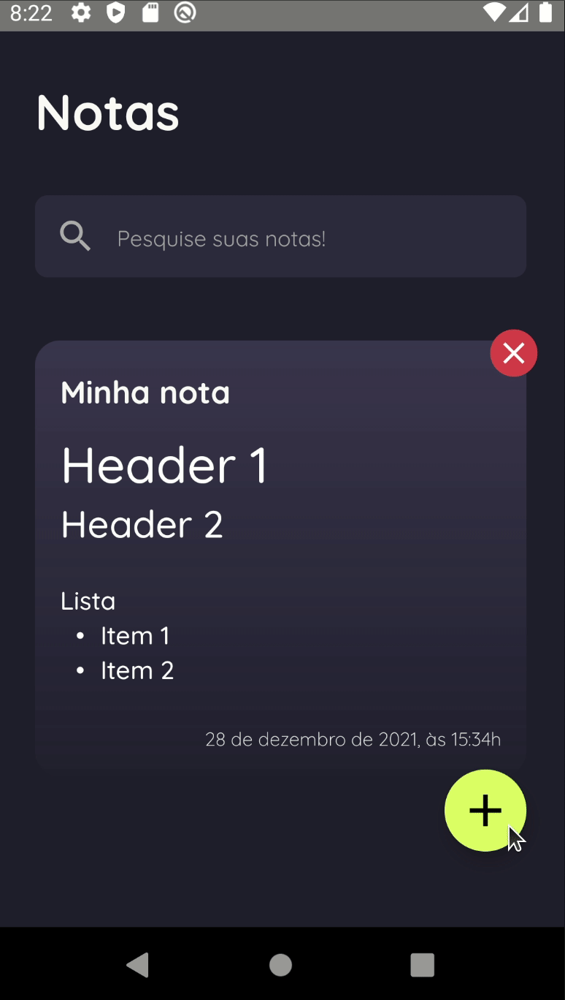

<link rel="preconnect" href="https://fonts.gstatic.com">
<link href="https://fonts.googleapis.com/css2?family=Nunito:wght@700&display=swap" rel="stylesheet">
<link href="https://fonts.googleapis.com/css2?family=Quicksand:wght@700&display=swap" rel="stylesheet">

<!-- Logo -->

<h1 align="center" style="font-family: Quicksand">
  Marknotes
<h1>

<!-- Badges -->

  
  
  

  

<!-- Project Design -->

	

<!-- Summary -->

<h2>Summary</h2>

- [:bookmark: About](#bookmark-about)
- [:framed_picture: Layout](#framed_picture-layout)
- [:rocket: Technologies](#rocket-technologies)
- [:anger: Difficulties](#anger-difficulties)
- [:fire: What's next](#fire-whats-next)

## :bookmark: About

**Marknotes** is an application that allows users to save their notes in Markdown format.

## :framed_picture: Layout

The layout of this application is available on [Figma](https://www.figma.com/file/pTDDY6X3imBxEVXwbbmrgr/Marknotes?node-id=110%3A120).

## :rocket: Technologies

This application uses the following technologies:

- [React Native](https://reactnative.dev/)
- [TypeScript](https://www.typescriptlang.org/)
- [Redux Toolkit](https://redux-toolkit.js.org/) (Global state management)
- [React Navigation](https://reactnavigation.org/) (Routing)
- [NativeBase](https://nativebase.io/) (Accessible components)
- [Date FNS](https://date-fns.org/) (Date formatting)
- [Jest](https://jestjs.io/) (Testing Framework)
- [React Native Testing Library](https://callstack.github.io/react-native-testing-library/)

## :anger: Difficulties

- Use TDD when creating features
- Isolating NativeBase stylesheet props in styles file
- Identify and isolate what should be tested

## :fire: What's next

- [ ] Help buttons for markdown text
- [ ] Grid of notes on Home

---

  Made with 💚 by <a href="https://github.com/igooralm192" target="_blank">Igor Almeida</a>

